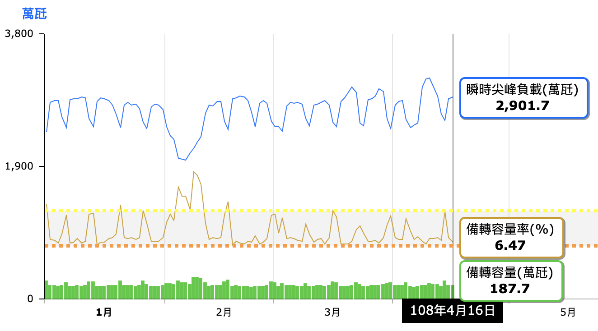
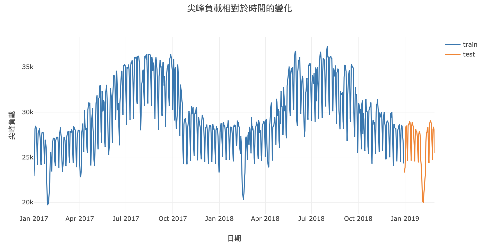
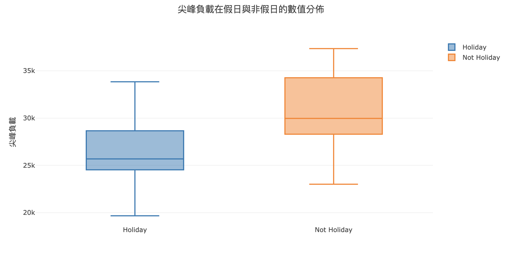
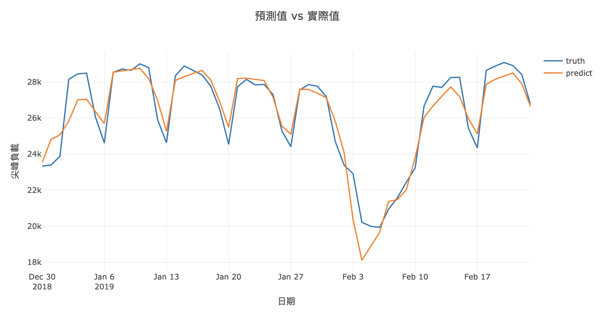

# 資料科學與人工智慧競技作業-預測台電尖峰負載

## 問題說明

利用 2017/1/1 ~ 2019/2/28 的台電歷史資料，預測未來七天 (2019/4/2~2019/4/8) 的「電力尖峰負載(MW)」。

## 使用資料

[台灣電力公司_過去電力供需資訊](https://data.gov.tw/dataset/19995)：HW1/data/elec_merge.csv

[政府行政機關辦公日曆表](https://data.gov.tw/dataset/26557)：HW1/data/calendar.csv

## 訓練資料與測試資料

使用 2017~2018 年的資料進行訓練，並以 2019 年 1 月及 2 月的資料進行測試。

## 分析假日與非假日的電力負載

觀察到假日的尖峰負載明顯低於非假日。

## 嘗試方法

- LSTM with Univariate Input and Vector Output
- Encoder-Decoder LSTM with Univariate Input
- Encoder-Decoder LSTM with Multivariate Input

最終使用的模型為 Encoder-Decoder LSTM with Multivariate Input。

## 測試資料結果

整體 RMSE 為 845.346。

## 最終預測結果

待更新。

## 連結

[Jupyter nbviewer 連結](https://nbviewer.jupyter.org/github/p61402/DSAI_HW1/blob/master/HW1/Encoder-Decoder%20LSTM%20with%20Multivariate%20Input.ipynb) 